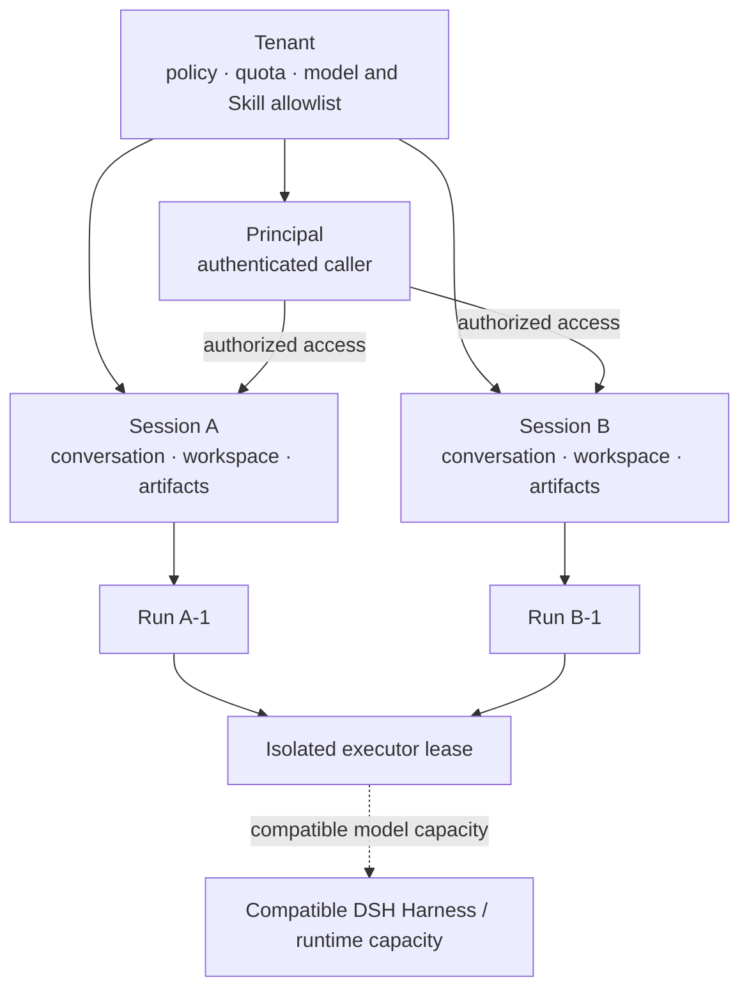
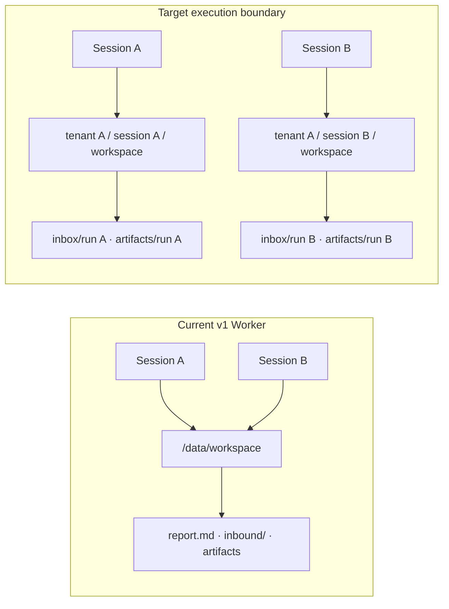
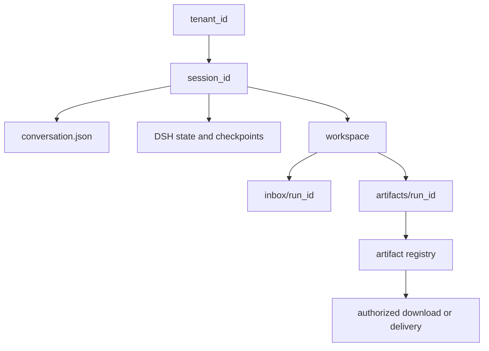
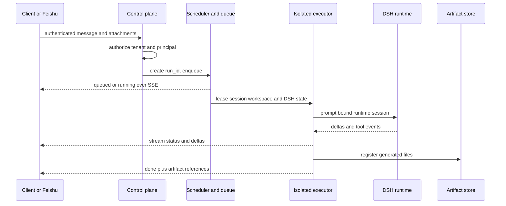
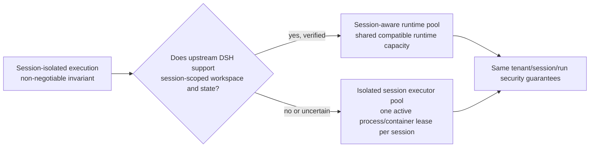
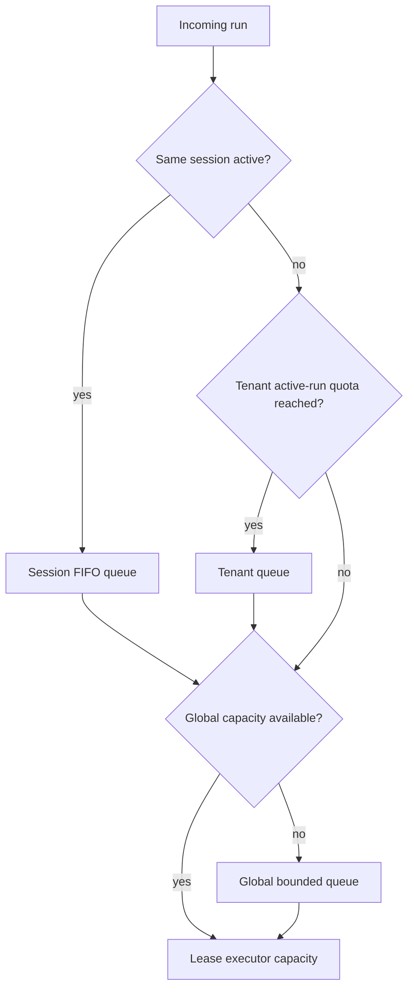

# Tenant, Session, and Runtime Design

[中文版本](tenant-session-runtime-design.zh-CN.md)

> **Status: target architecture.** This document defines the desired hosted,
> multi-tenant end state. It does not claim that the current v1 Worker already
> implements these boundaries, and it leaves the runtime-reuse mechanism open
> until upstream DSH session-workspace capabilities are verified.

## Decision

The hosted platform treats a **tenant** as the policy and ownership boundary, a **session** as the conversation and file boundary, and a **Harness/runtime** as a reusable execution resource. A tenant does not own one permanent Harness, and a session does not require one permanent runtime process.

~~~text
Tenant
  owns: identity policy, quotas, allowed models and Skills, storage namespace
  │
  ├── Session A + model fast
  │     owns: conversation, DSH runtime session, workspace, artifacts
  │     executes on: compatible runtime capacity from the model pool
  │
  ├── Session B + model fast
  │     owns: conversation, DSH runtime session, workspace, artifacts
  │     executes on: compatible runtime capacity from the model pool
  │
  └── Session C + model pro
        owns: conversation, DSH runtime session, workspace, artifacts
        executes on: compatible runtime capacity from the pro-model pool
~~~

This preserves lightweight, multiplexed DSH runtime sessions while removing the shared-workspace boundary.

**Reading the diagram:** the tenant governs access and quota; the session owns
state and files; a run is one request; an executor lease supplies isolated
execution. Runtime capacity is reusable only after the executor boundary is in
place.

## Why This Is the Target

One DSH Harness owns a long-lived JSON-RPC runtime subprocess. The SDK can send multiple session prompts through that subprocess, separates JSON-RPC responses by request ID, and filters streamed notifications by DSH session ID. A runtime session is therefore much cheaper than a runtime subprocess and can be concurrent.

Creating a permanent Harness per tenant wastes processes for idle tenants. Creating a permanent Harness per session has the same problem at a larger scale. Files, memory, authorization, and artifacts must be isolated by session; the model runtime process does not have to be.

## Current State and Gap

The v1 Worker already serializes turns for one public session ID, persists conversation memory per session, binds a session to one model, and allows independent sessions to run concurrently. It creates one Harness per model alias and fixes that Harness to one shared workspace.

~~~text
Current Worker
  model alias
    → shared Harness / JSON-RPC runtime
       → DSH session A
       → DSH session B
       → DSH session C
    → shared /data/workspace                 ← gap
~~~

- server.py:271 fixes the Harness working directory when it is created.
- server.py:308 serializes requests inside one session; server.py:265 limits independent active turns globally.
- server.py:667 assigns a distinct DSH runtime session ID to each model-alias and public-session pair.

The shared workspace means two independent sessions can still read or overwrite the same file. The workspace-write sandbox prevents writes outside the workspace, but it does not distinguish two sessions inside it.

## Final Ownership Model

| Layer | Stable identifier | Owns | Does not own |
| --- | --- | --- | --- |
| Tenant | tenant_id | policy, billing/quota, model and Skill allowlists, storage namespace, audit retention | a permanent single Harness or a shared conversation |
| Principal | principal_id | caller identity and tenant role | arbitrary tenant or session access |
| Session | server-issued session_id | model binding, conversation memory, DSH runtime session ID, workspace, session lock | another session's files or memory |
| Run | server-issued run_id | one request, event stream, input manifest, output artifacts, lifecycle status | long-term conversation state |
| Runtime lease | internal runtime_id | one active DSH Harness subprocess and compatible model configuration | tenant ownership or persistent artifacts |

The control plane derives tenant ID and principal ID from an authenticated caller. A public client cannot choose a raw session ID and thereby claim its history. Feishu mappings are server-derived: direct message to user conversation, group to group conversation, and thread to thread conversation.

## Storage Layout

Every session receives a dedicated root below the tenant namespace. Directory names use server-generated opaque IDs or hashes; raw user-controlled strings never become paths.

~~~text
tenants/<tenant-id>/
  sessions/<session-id>/
    conversation.json                 # model binding and bounded conversation memory
    dsh-state/                        # DSH JSONL and checkpoints for this session
    workspace/                        # only writable project tree visible to the Agent
      inbox/<run-id>/                 # trusted input attachments for one run
      artifacts/<run-id>/             # output files for one run
      scratch/                        # session-scoped temporary work
  audit/<run-id>.jsonl                # immutable run events and usage references
~~~

Attachments and generated files are registered as artifacts. A response carries an artifact ID or signed download URL, never an arbitrary shared-workspace path. Retention and deletion are tenant policy decisions.

## Execution Model

The control plane schedules a run only after it resolves the tenant, principal, session, and bound model.

~~~text
1. Client → Control plane: authenticated request or Feishu event
2. Control plane → Session store: authorize principal and resolve or create session
3. Control plane → Run store: create run_id and persist queued state
4. Scheduler:
     same session active?       queue behind that session
     tenant active limit hit?   queue under tenant quota
     global active limit hit?   queue globally
     otherwise                  lease compatible runtime capacity
5. Isolated executor:
     mount only session workspace and session dsh-state
     run DSH with the bound model and DSH runtime session ID
6. Executor → Artifact store: register outputs
7. Executor → Event stream: status, tool events, deltas, done or error
8. Control plane → Client: terminal result and artifact references
~~~

The same session is always serial. Different sessions may run concurrently, subject to tenant and global quotas. Long-running media jobs become asynchronous artifact jobs after submission; they do not occupy an interactive DSH runtime lease while the provider renders media.

## Runtime Pool and Execution Isolation

The runtime pool is organized by compatible model configuration, not by tenant.

~~~text
Pool key = model alias + runtime image/config version + tool policy version

deepseek-v4-flash pool
  ├── runtime 1: sessions A, B, D while active
  └── runtime 2: sessions C, E when capacity requires

seed-2.1-pro pool
  └── runtime 3: compatible sessions only
~~~

A runtime lease is short-lived and reusable. It may process more than one session only when the runtime API can safely multiplex DSH session IDs **and** the executor prevents filesystem visibility across those sessions.

The current SDK fixes cwd, DSH_CWD, and DSH_SESSION_ROOT at Harness construction; its public run API accepts only session ID and input. Do not dynamically mutate those process-wide values to emulate session workspaces: concurrent turns would race.

The final invariant is **session-isolated execution**, not a mandatory shared-runtime implementation. There are two valid end-state mechanisms:

| Mechanism | When it is valid | Runtime reuse |
| --- | --- | --- |
| Session-aware DSH runtime pool | Upstream DSH supports a session-level workspace and session state root while concurrently multiplexing sessions | A compatible runtime may serve multiple sessions |
| Isolated session executor pool | DSH keeps process-wide cwd or other process-wide tool state | Pool capacity is reusable, but each active session receives its own process/container lease |

The second path is safe with the current SDK. It does not mean one permanent Harness per session: the process/container is created or leased for an active session, then stopped and recycled after idle expiry. The first path becomes preferable only after a verified upstream session-workspace contract exists.

## Isolation Choices

| Choice | Runtime reuse | File isolation | Use |
| --- | --- | --- | --- |
| One shared Worker workspace | high | none between sessions | current trusted single-domain mode only |
| One Harness per session in one container | low | logical only unless extra mounts or users are added | not recommended as the default |
| Session-aware DSH runtime pool | high | strong, when upstream supports session-scoped workspace roots | preferred after capability validation |
| Isolated session executor pool | capacity-level reuse | strong filesystem boundary | recommended with the current SDK |
| MicroVM or sandboxed pod per run | lower | strongest boundary | high-risk tools or untrusted tenants |

The recommended execution unit is a short-lived container or sandboxed worker with only these mounts:

~~~text
/workspace  → tenants/<tenant>/sessions/<session>/workspace
/state      → tenants/<tenant>/sessions/<session>/dsh-state
/skills     → read-only approved Skill bundle
~~~

It must not receive the Docker socket, other tenant roots, long-lived provider secrets, or unrestricted host-network access. A Model Gateway can issue short-lived, policy-bound credentials for the selected model.

## Concurrency and Fairness

The current deployment has a global active-turn limit of 10. The target keeps a global cap but replaces immediate rejection with a bounded scheduler queue.

| Scope | Rule | Initial policy |
| --- | --- | --- |
| Session | one active run | later messages queue in order |
| Tenant | bounded active runs | start with 2; make plan-configurable |
| Global | bounded active runs | current capacity: 10 |
| Queue | bounded waiting runs and TTL | return queued with run ID; reject only when full |
| Media render | asynchronous job after submit | does not hold an interactive slot |

This prevents one noisy tenant from consuming all capacity and lets a client observe queued work through SSE instead of retrying after a 429 response.

## External API Direction

The v1 endpoints remain useful for trusted local compatibility. The hosted API should use server-owned resources:

~~~text
POST /v1/sessions
  → 201 { session_id, model, created_at }

POST /v1/sessions/{session_id}/runs
  → 202 { run_id, status: queued or running }

GET /v1/runs/{run_id}/events
  → SSE: queued, status, assistant.delta, tool.call, tool.result, artifact, done, error

GET /v1/artifacts/{artifact_id}
  → authorized download or redirect to a short-lived object-storage URL
~~~

The control plane derives tenant and principal from credentials. It rejects a session that belongs to a different tenant or principal. The v1 chat and chat/stream interface remains loopback-only until this boundary exists.

## Invariants

1. No run can read or write another session's workspace through its execution mount.
2. No caller can access a session without authorization through its tenant and principal binding.
3. A session's model binding remains immutable; choosing another model creates a new session.
4. A session has at most one active run; its memory and DSH event order are deterministic.
5. All generated files are registered artifacts before they are returned to a caller.
6. Runtime reuse never weakens the filesystem, credential, or event-stream boundary.
7. A failed or restarted executor recovers queued and running state from the run store without replaying a completed artifact delivery.

## Migration Plan

### Phase 1 — Establish server-owned identities

- Add tenant, principal, session, run, and artifact records to the control plane.
- Keep the current Worker as the trusted single-tenant executor behind the new API.
- Derive Feishu session ownership from Feishu sender, chat, and thread metadata.

### Phase 2 — Separate state and artifacts

- Move conversation records and DSH persistence from process-global roots into tenant/session roots.
- Move inbound Feishu media from the shared inbound directory to workspace/inbox/<run-id>/.
- Register output files as artifacts; preserve the existing asynchronous media delivery worker behind the artifact API.

### Phase 3 — Add scheduler and quotas

- Replace immediate global 429 busy with persistent queue states and SSE status events.
- Enforce session serialization, tenant active-run caps, global capacity, time limits, and artifact retention.

### Phase 4 — Isolated execution workers

- Run each leased session in a container or pod with only its workspace and DSH state mounted.
- Introduce executor-pool capacity and idle eviction. Promote this to a shared per-model DSH runtime pool only after validating a session-scoped workspace contract in upstream DSH.
- Route model calls through a credential-aware Model Gateway.

### Phase 5 — Harden and operate

- Add audit-log retention, per-tenant observability, usage accounting, retries, cancellation, cleanup, backups, and disaster recovery drills.
- Move high-risk Skills or untrusted workloads to stronger sandbox classes when required.

## Success Criteria

The target design is complete when the following can be demonstrated:

1. Two concurrent sessions cannot list, read, modify, or return each other's attachments or artifacts.
2. Two tenants cannot resolve each other's sessions, runs, or artifacts even when they know the identifiers.
3. Multiple sessions execute concurrently through a bounded runtime pool without cross-session SSE events or memory leakage.
4. A restarted worker resumes durable queue and artifact-delivery state without duplicating user-visible results.
5. Capacity, tenant fairness, cost, latency, and failures are measurable by tenant, model, session, and run.
