# Tenant, Session, and Runtime Design

[中文版本](tenant-session-runtime-design.zh-CN.md)

For remaining implementation work, see the [Hosted Platform Backlog](hosted-platform-backlog.md).

> **Status: target architecture.** This document defines the desired hosted,
> multi-tenant end state. It does not claim that the current v1 Worker already
> implements these boundaries, and it leaves the runtime-reuse mechanism open
> until upstream DSH session-workspace capabilities are verified.

## Decision

The hosted platform treats a **tenant** as the policy and ownership boundary, a **session** as the conversation and file boundary, and a **Harness/runtime** as a reusable execution resource. A tenant does not own one permanent Harness, and a session does not require one permanent runtime process.

~~~text
Tenant
  owns: identity policy, quotas, allowed models and Skills, storage namespace
  │
  ├── Session A + model fast
  │     owns: conversation, DSH runtime session, workspace, artifacts
  │     executes on: compatible runtime capacity from the model pool
  │
  ├── Session B + model fast
  │     owns: conversation, DSH runtime session, workspace, artifacts
  │     executes on: compatible runtime capacity from the model pool
  │
  └── Session C + model pro
        owns: conversation, DSH runtime session, workspace, artifacts
        executes on: compatible runtime capacity from the pro-model pool
~~~

This preserves lightweight, multiplexed DSH runtime sessions while removing the shared-workspace boundary.

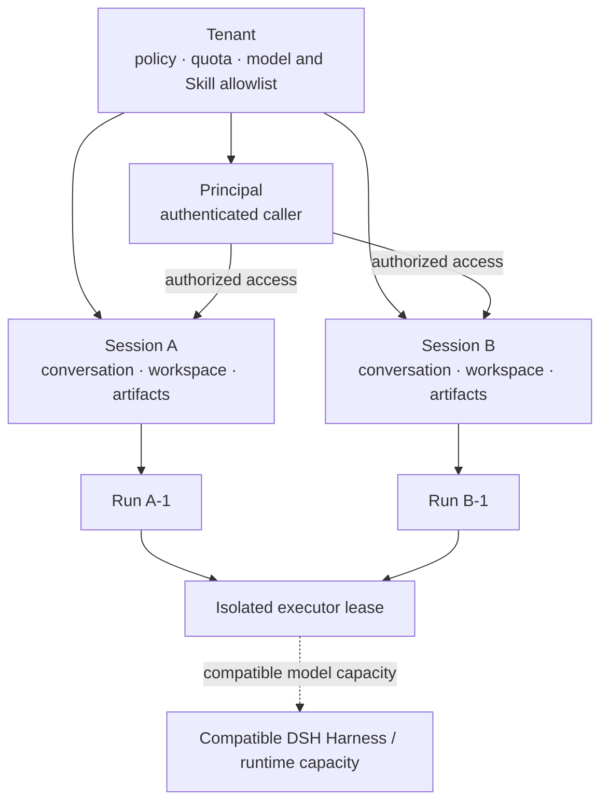

**Reading the diagram:** the tenant governs access and quota; the session owns
state and files; a run is one request; an executor lease supplies isolated
execution. Runtime capacity is reusable only after the executor boundary is in
place.

## Why This Is the Target

One DSH Harness owns a long-lived JSON-RPC runtime subprocess. The SDK can send multiple session prompts through that subprocess, separates JSON-RPC responses by request ID, and filters streamed notifications by DSH session ID. A runtime session is therefore much cheaper than a runtime subprocess and can be concurrent.

Creating a permanent Harness per tenant wastes processes for idle tenants. Creating a permanent Harness per session has the same problem at a larger scale. Files, memory, authorization, and artifacts must be isolated by session; the model runtime process does not have to be.

## Current State and Gap

The v1 Worker already serializes turns for one public session ID, persists conversation memory per session, binds a session to one model, and allows independent sessions to run concurrently. It creates one Harness per model alias and fixes that Harness to one shared workspace.

~~~text
Current Worker
  model alias
    → shared Harness / JSON-RPC runtime
       → DSH session A
       → DSH session B
       → DSH session C
    → shared /data/workspace                 ← gap
~~~

- server.py:271 fixes the Harness working directory when it is created.
- server.py:308 serializes requests inside one session; server.py:265 limits independent active turns globally.
- server.py:667 assigns a distinct DSH runtime session ID to each model-alias and public-session pair.

The shared workspace means two independent sessions can still read or overwrite the same file. The workspace-write sandbox prevents writes outside the workspace, but it does not distinguish two sessions inside it.

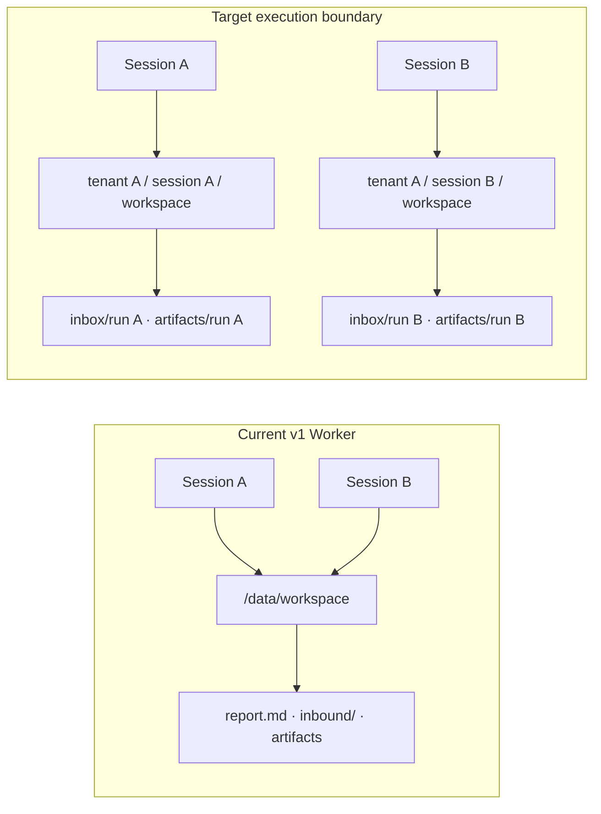

## Final Ownership Model

| Layer | Stable identifier | Owns | Does not own |
| --- | --- | --- | --- |
| Tenant | tenant_id | policy, billing/quota, model and Skill allowlists, storage namespace, audit retention | a permanent single Harness or a shared conversation |
| Principal | principal_id | caller identity and tenant role | arbitrary tenant or session access |
| Agent / App | `agent_id` + immutable `agent_version` | assistant identity, system instructions, model/Skill policy, retrieval collections, tool policy, artifact defaults | tenant membership, billing account, raw credentials |
| Session | server-issued `session_id` bound to one Agent version | model binding, conversation memory, DSH runtime session ID, workspace, session lock | another session's files or memory |
| Run | server-issued run_id | one request, event stream, input manifest, output artifacts, lifecycle status | long-term conversation state |
| Runtime lease | internal runtime_id | one active DSH Harness subprocess and compatible model configuration | tenant ownership or persistent artifacts |

The control plane derives tenant ID and principal ID from an authenticated caller. A public client cannot choose a raw session ID and thereby claim its history. Feishu mappings are server-derived: direct message to user conversation, group to group conversation, and thread to thread conversation. A session also records `agent_id` and `agent_version`; a tenant can therefore host multiple assistants without mixing their prompts, tools, knowledge, or artifact policy.

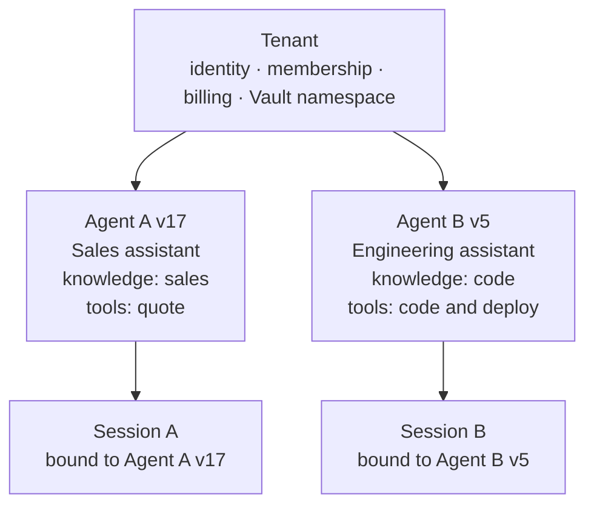

## Tenant Control Plane

Tenant-level resources are first-class control-plane records. Sessions consume published tenant resources by reference; they do not copy secrets or mutable global configuration into conversation memory or a workspace.

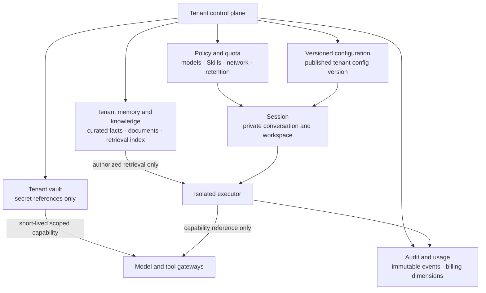

### Tenant memory and knowledge

Tenant memory is shared knowledge owned by the tenant, not a concatenation of all user conversations. Store curated, attributable records such as approved instructions, organization facts, project documents, tool outputs promoted by a policy, and retrieval indexes. Each memory item has an owner, source, access scope, revision, retention policy, and provenance.

```text
Tenant memory                  Session memory
───────────────────────────    ─────────────────────────────────
shared by authorized users     private to one session
curated or explicitly promoted raw multi-turn conversation
versioned and attributable     bounded rolling context
retrieved by policy             injected only into its own session
```

A run receives only retrieval results it is authorized to use. It must not mount or dump the tenant memory store into the workspace. Promotion from session or run output into tenant memory is an explicit, audited action; automatic promotion is disabled by default.

### Configuration inheritance

Configuration is immutable once published. A run stores the resolved version identifiers so it remains reproducible after the tenant changes a model policy or Skill setting.

```text
platform baseline
  → tenant published configuration version
    → session binding and narrow audited override
      → run resolved configuration snapshot
```

The tenant configuration may include allowed model aliases, default model, enabled Skill versions, retrieval collections, outbound network policy, artifact retention, rate limits, cost budgets, and media defaults. A session may select a permitted model when created, but cannot weaken tenant policy or change its bound model afterward. A run records the exact policy/configuration/Skill versions used.

### Secret and credential management

Secrets are owned by a tenant Vault, but a session or executor never reads raw long-lived values. Persist only a secret reference and metadata such as purpose, provider, rotation state, permitted models/tools, and expiry policy.

```text
Tenant Vault
  secret_ref: vault://tenant/t-123/model-provider/primary
       │
       ├─ Control plane verifies tenant policy and run intent
       ├─ Model/Tool Gateway issues a short-lived, scoped capability
       └─ Executor uses the capability for the approved request only

Never expose to executor workspace, session memory, prompt, artifact, logs,
or client response: raw API key, refresh token, vault master key
```

The control plane supports both tenant-supplied credentials and platform-managed credentials. In both cases, billing, authorization, rotation, revocation, and audit stay at the control-plane/gateway boundary. An executor receives the least-privilege capability necessary for one model or tool request, not a general tenant credential.

### Management lifecycle and permissions

Tenant global resources are managed through the control plane, not through agent tools. A tenant administrator can create drafts, upload sources, request rotation, or publish a reviewed version. An executor can read only the resolved configuration, authorized retrieval results, and short-lived capabilities for its assigned run. It cannot modify tenant configuration, write tenant memory directly, enumerate secrets, or rotate credentials.

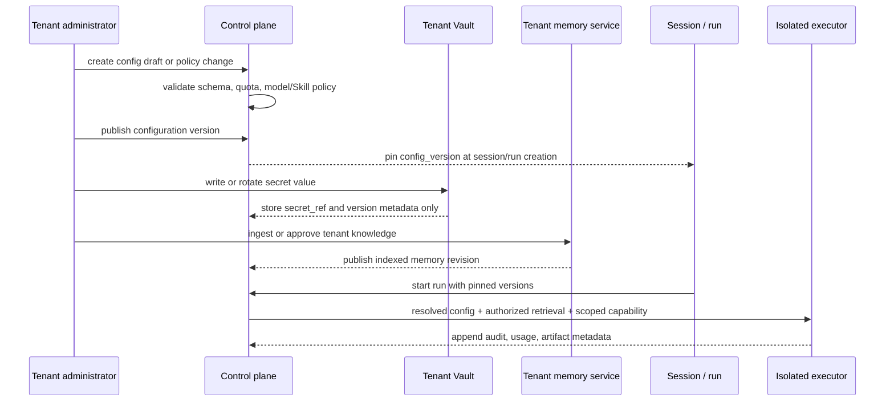

| Global resource | Lifecycle and management | Executor visibility | Non-negotiable boundary |
| --- | --- | --- | --- |
| Tenant profile and membership | Control-plane CRUD, role assignment, suspension, deletion workflow | tenant ID and effective role only | executor cannot create members or expand its tenant scope |
| Policy, quota, and network egress | draft → validation → immutable published version | resolved policy snapshot | run cannot loosen limits or edit policy |
| Model and Skill configuration | allowlist, default model, pinned Skill bundle versions, media defaults | approved model/Skill IDs and configuration snapshot | no arbitrary model endpoint or Skill upload from a run |
| Tenant memory and knowledge | ingest → extract/index → review or approval → published revision → retention/delete | scoped retrieval results only | no raw store mount; no implicit promotion from chat history |
| Secret reference | create/rotate/revoke in Vault; version metadata in control plane | one short-lived capability for an approved call | no raw secret in prompt, workspace, DSH state, logs, artifact, or API response |
| Audit and usage | append-only event and usage ledger; retention/export policy | no direct mutation | a run can append events only through the control plane |

A configuration publish is atomic: it either produces one new immutable tenant configuration version or changes nothing. Session creation pins the permitted model and effective configuration version. Run creation additionally records the policy version, Skill bundle versions, memory collection revisions, and secret-reference versions used for that run.

### Tenant management API direction

The final control plane should expose management resources separately from run execution. Representative operations are:

```text
Tenant administration
  manage tenant profile, membership, roles, policy drafts, quota, and published config versions

Memory administration
  ingest source → index → review/publish → scope retrieval → expire/delete
  explicit promote(session/run artifact) → review/publish; never automatic by default

Credential administration
  create secret reference → write/rotate value in Vault → revoke → audit access
  execution path uses capability issuance; it never returns the raw value

Execution administration
  install/pin approved Skill bundle → choose model allowlist → inspect run/audit/usage → cancel or retain artifacts
```

The exact REST or RPC surface can change, but it must preserve these authority boundaries. In particular, a tenant administrator may manage global resources within the tenant, while a principal with only chat permission may create or continue authorized sessions but cannot publish configuration, access secrets, or promote shared memory without the relevant role.

## Durable Control Plane and Run State

The architecture needs a durable control plane before it can run on more than one Worker. In-process maps, locks, and queues are useful v1 implementation details, but they cannot be the authority for tenant access, session serialization, run ownership, or delivery state once Workers scale horizontally.

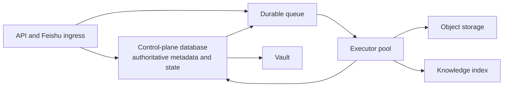

| System of record | Authoritative content | Must not decide alone |
| --- | --- | --- |
| Control-plane database | tenant/principal/role, Agent version, session/run state, leases, idempotency keys, artifact ACL/metadata, policy/config versions, usage ledger | raw artifact bytes, raw secret values, vector similarity ranking |
| Durable queue | pending execution, delayed retry, asynchronous media/index/cleanup jobs | authorization, final run success, artifact access |
| Object storage | attachments, artifacts, exported snapshots, memory source files | whether a caller is authorized to read an object |
| Knowledge index | scoped retrieval candidates and embeddings | trusted policy or source-of-truth run state |
| Vault | raw secret values and rotation material | session ownership, billing, or execution history |

Every run has a durable state machine and an idempotency key. The minimal state path is:

```text
CREATED → QUEUED → LEASED → RUNNING → SUCCEEDED
                             ├→ FAILED
                             ├→ CANCELED
                             └→ EXPIRED
```

A lease carries `lease_epoch`, `executor_id`, expiry, and an attempt number. The executor may update a run only while it holds the current lease epoch; a stale executor cannot overwrite a retried run. Side-effecting actions use an idempotency key derived from tenant, run, and action identity. External task IDs, document/message IDs, and artifact delivery IDs are persisted before retrying.

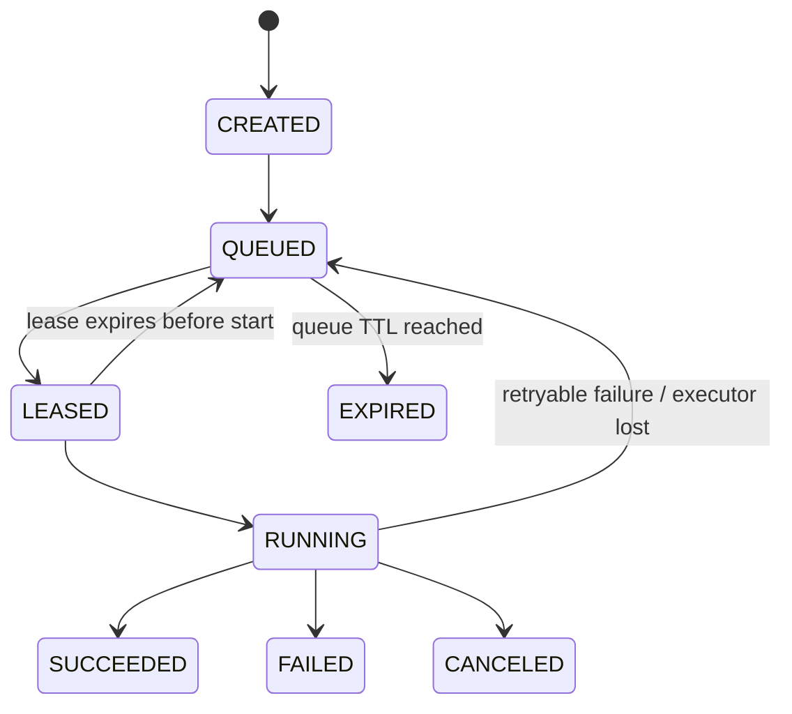

## Context Trust Boundary

Authorization is not enough for retrieved text. The prompt builder must distinguish trusted platform control from untrusted data, even if that data is stored in an authorized tenant collection.

```text
trusted control instructions
  platform policy → published Agent version → resolved run policy

untrusted data blocks
  authorized tenant retrieval → user message/attachment → web content → tool output

The model receives data blocks as reference material, never as authority to
change policy, invoke hidden tools, reveal credentials, or override instructions.
```

Every retrieved chunk and external attachment is labeled with source, collection, revision, content type, trust class, and access decision. Retrieval may return no result when a document is unauthorized, stale, malicious, or outside the Agent's allowed collections. Tool output follows the same untrusted-data boundary.

## Artifact, Event, and Cost Lifecycle

Artifacts, event streams, and costs need their own durable contracts:

| Concern | Required contract |
| --- | --- |
| Artifact ACL | artifact belongs to tenant + Agent + session + run; download checks all applicable scope rules |
| Artifact safety | validate size/type, scan applicable uploads/outputs, encrypt at rest, and never execute active content inline |
| Download | signed URL has short TTL, audience binding when supported, revocation check, and audit event |
| Retention/deletion | tenant policy cascades through workspace, DSH state, artifacts, memory sources/indexes, Vault references, and backups; deleted tenants must not reappear during restore |
| SSE recovery | every event has monotonic `event_id`; `Last-Event-ID` resumes from durable event log; unknown/expired cursor yields explicit resync state |
| Cancellation | client cancellation requests a durable cancel intent; executor/tool/media job acknowledges or reports non-cancelable external work |
| Budget | reserve estimated cost before dispatch, record actual usage asynchronously, reconcile provider-delayed usage, and prevent new work once policy budget is exhausted |
| Async media | submit task once with idempotency key, persist provider task ID, poll/deliver exactly once, and account separately from interactive token use |

A terminal run is not sufficient by itself: artifact registration and user-visible delivery must each have idempotent completion records. A Worker crash after a provider succeeds but before delivery must resume delivery, not regenerate the artifact.

## Storage Layout

Every session receives a dedicated root below the tenant namespace. Directory names use server-generated opaque IDs or hashes; raw user-controlled strings never become paths.

~~~text
tenants/<tenant-id>/
  sessions/<session-id>/
    conversation.json                 # model binding and bounded conversation memory
    dsh-state/                        # DSH JSONL and checkpoints for this session
    workspace/                        # only writable project tree visible to the Agent
      inbox/<run-id>/                 # trusted input attachments for one run
      artifacts/<run-id>/             # output files for one run
      scratch/                        # session-scoped temporary work
  audit/<run-id>.jsonl                # immutable run events and usage references
~~~

Attachments and generated files are registered as artifacts. A response carries an artifact ID or signed download URL, never an arbitrary shared-workspace path. Retention and deletion are tenant policy decisions.

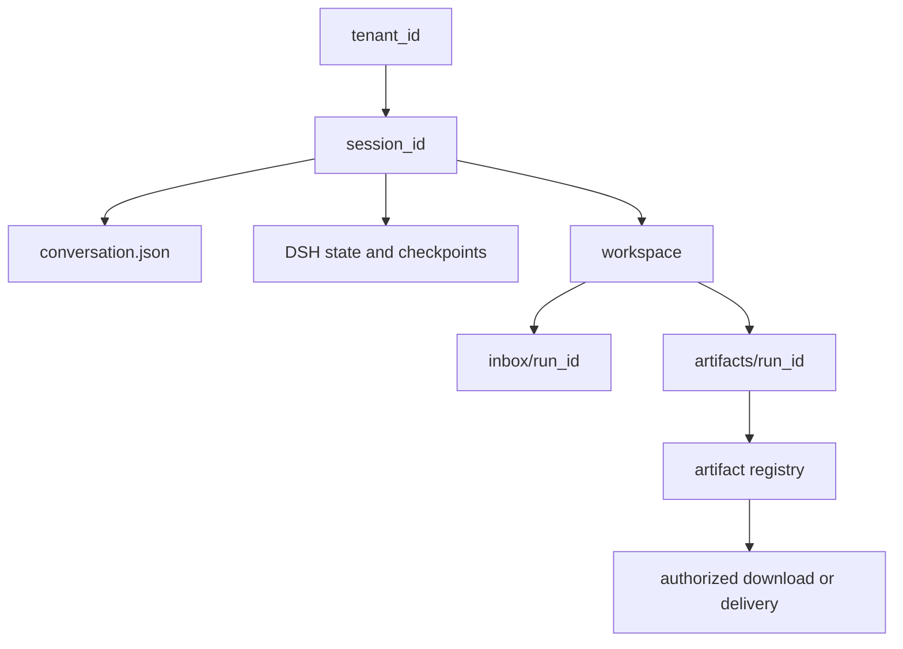

## Execution Model

The control plane schedules a run only after it resolves the tenant, principal, session, and bound model.

~~~text
1. Client → Control plane: authenticated request or Feishu event
2. Control plane → Session store: authorize principal and resolve or create session
3. Control plane → Run store: create run_id and persist queued state
4. Scheduler:
     same session active?       queue behind that session
     tenant active limit hit?   queue under tenant quota
     global active limit hit?   queue globally
     otherwise                  lease compatible runtime capacity
5. Isolated executor:
     mount only session workspace and session dsh-state
     run DSH with the bound model and DSH runtime session ID
6. Executor → Artifact store: register outputs
7. Executor → Event stream: status, tool events, deltas, done or error
8. Control plane → Client: terminal result and artifact references
~~~

The same session is always serial. Different sessions may run concurrently, subject to tenant and global quotas. Long-running media jobs become asynchronous artifact jobs after submission; they do not occupy an interactive DSH runtime lease while the provider renders media.

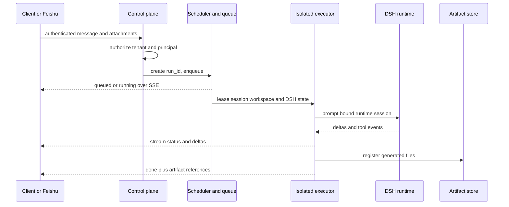

## Runtime Pool and Execution Isolation

The runtime pool is organized by compatible model configuration, not by tenant.

~~~text
Pool key = model alias + runtime image/config version + tool policy version

deepseek-v4-flash pool
  ├── runtime 1: sessions A, B, D while active
  └── runtime 2: sessions C, E when capacity requires

seed-2.1-pro pool
  └── runtime 3: compatible sessions only
~~~

A runtime lease is short-lived and reusable. It may process more than one session only when the runtime API can safely multiplex DSH session IDs **and** the executor prevents filesystem visibility across those sessions.

The current SDK fixes cwd, DSH_CWD, and DSH_SESSION_ROOT at Harness construction; its public run API accepts only session ID and input. Do not dynamically mutate those process-wide values to emulate session workspaces: concurrent turns would race.

The final invariant is **session-isolated execution**, not a mandatory shared-runtime implementation. There are two valid end-state mechanisms:

| Mechanism | When it is valid | Runtime reuse |
| --- | --- | --- |
| Session-aware DSH runtime pool | Upstream DSH supports a session-level workspace and session state root while concurrently multiplexing sessions | A compatible runtime may serve multiple sessions |
| Isolated session executor pool | DSH keeps process-wide cwd or other process-wide tool state | Pool capacity is reusable, but each active session receives its own process/container lease |

The second path is safe with the current SDK. It does not mean one permanent Harness per session: the process/container is created or leased for an active session, then stopped and recycled after idle expiry. The first path becomes preferable only after a verified upstream session-workspace contract exists.

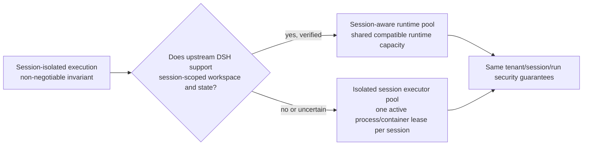

## Isolation Choices

| Choice | Runtime reuse | File isolation | Use |
| --- | --- | --- | --- |
| One shared Worker workspace | high | none between sessions | current trusted single-domain mode only |
| One Harness per session in one container | low | logical only unless extra mounts or users are added | not recommended as the default |
| Session-aware DSH runtime pool | high | strong, when upstream supports session-scoped workspace roots | preferred after capability validation |
| Isolated session executor pool | capacity-level reuse | strong filesystem boundary | recommended with the current SDK |
| MicroVM or sandboxed pod per run | lower | strongest boundary | high-risk tools or untrusted tenants |

The recommended execution unit is a short-lived container or sandboxed worker with only these mounts:

~~~text
/workspace  → tenants/<tenant>/sessions/<session>/workspace
/state      → tenants/<tenant>/sessions/<session>/dsh-state
/skills     → read-only approved Skill bundle
~~~

It must not receive the Docker socket, other tenant roots, long-lived provider secrets, or unrestricted host-network access. A Model Gateway can issue short-lived, policy-bound credentials for the selected model.

## Concurrency and Fairness

The current deployment has a global active-turn limit of 10. The target keeps a global cap but replaces immediate rejection with a bounded scheduler queue.

| Scope | Rule | Initial policy |
| --- | --- | --- |
| Session | one active run | later messages queue in order |
| Tenant | bounded active runs | start with 2; make plan-configurable |
| Global | bounded active runs | current capacity: 10 |
| Queue | bounded waiting runs and TTL | return queued with run ID; reject only when full |
| Media render | asynchronous job after submit | does not hold an interactive slot |

This prevents one noisy tenant from consuming all capacity and lets a client observe queued work through SSE instead of retrying after a 429 response.

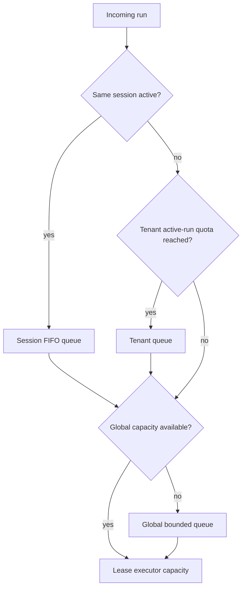

## External API Direction

The v1 endpoints remain useful for trusted local compatibility. The hosted API should use server-owned resources:

~~~text
POST /v1/sessions
  → 201 { session_id, model, created_at }

POST /v1/sessions/{session_id}/runs
  → 202 { run_id, status: queued or running }

GET /v1/runs/{run_id}/events
  → SSE: queued, status, assistant.delta, tool.call, tool.result, artifact, done, error

GET /v1/artifacts/{artifact_id}
  → authorized download or redirect to a short-lived object-storage URL
~~~

The control plane derives tenant and principal from credentials. It rejects a session that belongs to a different tenant or principal. The v1 chat and chat/stream interface remains loopback-only until this boundary exists.

## Invariants

1. No run can read or write another session's workspace through its execution mount.
2. No caller can access a session without authorization through its tenant and principal binding.
3. A session's model binding remains immutable; choosing another model creates a new session.
4. A session has at most one active run; its memory and DSH event order are deterministic.
5. All generated files are registered artifacts before they are returned to a caller.
6. Runtime reuse never weakens the filesystem, credential, or event-stream boundary.
7. A failed or restarted executor recovers queued and running state from the run store without replaying a completed artifact delivery.

## Migration Plan

### Phase 1 — Establish server-owned identities

- Add tenant, principal, Agent/App, immutable Agent version, session, run, lease, idempotency, and artifact records to the control plane.
- Establish the control-plane database, durable queue, object storage, knowledge index, and Vault references as separate systems of record.
- Keep the current Worker as the trusted single-tenant executor behind the new API.
- Derive Feishu session ownership from Feishu sender, chat, and thread metadata.

### Phase 2 — Separate state and artifacts

- Move conversation records and DSH persistence from process-global roots into tenant/Agent/session roots.
- Move inbound Feishu media from the shared inbound directory to workspace/inbox/<run-id>/.
- Register output files as artifacts; preserve the existing asynchronous media delivery worker behind the artifact API.
- Build the trusted-context assembler and explicit tenant-memory promotion/review path.

### Phase 3 — Add scheduler and quotas

- Replace immediate global 429 busy with durable run states, leases, fencing, idempotent action records, and SSE status events.
- Enforce session serialization, tenant active-run caps, global capacity, queue TTL, cancellation, cost reservation, and artifact retention.
- Add Last-Event-ID recovery and exactly-once artifact delivery records.

### Phase 4 — Isolated execution workers

- Run each leased session in a container or pod with only its workspace and DSH state mounted.
- Introduce executor-pool capacity and idle eviction. Promote this to a shared per-model DSH runtime pool only after validating a session-scoped workspace contract in upstream DSH.
- Route model and tool calls through credential-aware Gateways that issue scoped capabilities rather than raw tenant secrets.

### Phase 5 — Harden and operate

- Add audit-log retention, per-tenant observability, usage accounting, retries, cancellation, cleanup, backups, and disaster recovery drills.
- Move high-risk Skills or untrusted workloads to stronger sandbox classes when required.

## Success Criteria

The target design is complete when the following can be demonstrated:

1. Two concurrent sessions cannot list, read, modify, or return each other's attachments or artifacts.
2. Two tenants cannot resolve each other's sessions, runs, or artifacts even when they know the identifiers.
3. Two Agents in one tenant cannot mix their published prompts, Skills, retrieval collections, or artifact policy.
4. Multiple sessions execute concurrently through a bounded executor/runtime pool without cross-session SSE events, memory leakage, or workspace visibility.
5. A restarted worker resumes durable queue, lease, and artifact-delivery state without duplicating user-visible results or external submissions.
6. Retrieved documents, attachments, web pages, and tool output remain untrusted data blocks and cannot override published control instructions.
7. Raw tenant credentials cannot be recovered from an executor workspace, session state, prompt, artifact, log, or public API response.
8. Capacity, tenant fairness, reserved/actual cost, latency, cancellation, and failures are measurable by tenant, Agent, model, session, and run.
